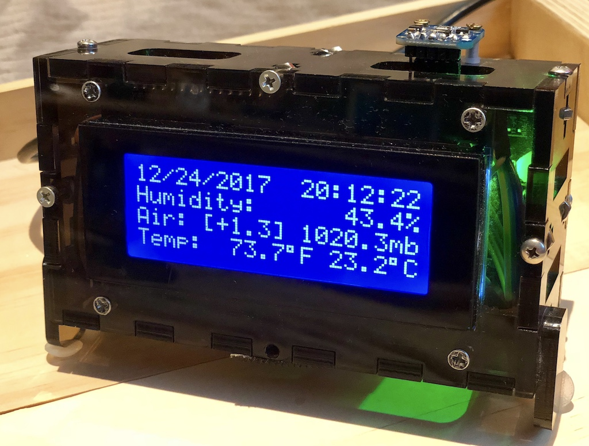

[](https://travis-ci.org/kigster/weather-pod)

# WeatherPod

**Full Project inside an Enclosure:**



## Setup and Build

### Prerequisites 

 * CMake
 * Arduino SDK
 * Ruby 2.3+ (although setup script installs it if not found)

### Automated Setup

Checkout the repo into `weather-pod` folder:

```bash
cd weather-pod
bin/setup
bin/build src
```

### Manual Build

The process to build and upload manually is super simple too:

```bash
cd src
rm -rf build && mkdir build && cd build
cmake ..
make 
make upload
```

You can also connect to a serial device like so:

```
make WeatherPod-serial
```

### Directory Structure 

The directory structure should look as follows:

```
  WeatherPod
     |
     |__ bin/
     |   |___ setup                           <———— provided by the arli-cmake
     |   |___ build                           <———— provided by the arli-cmake
     |
     |__ cmake/
     |   |___ Arli.cmake                      <———— provided by the arli-cmake 
     |   |___ ArduinoToolchain.cmake          <———— provided by arduino-cmake 
     |   |___ Platform/                       <———— provided by arduino-cmake
     |
     |__ src/
         |___ Arlifile                        <———— provided by the arli-cmake
         |___ CMakeLists.txt                  <———— provided by the arli-cmake
         |___ WeatherPod.cpp
         |___ SetTime.h

```

## How Was This Project Created?

It was created using Arli — Arduino project generator and a library manager, that relies on CMake and the arduino-cmake project. 

### Acknowledgements

The following projects made this project so easy:

 * [`arli`](https://github.com/kigster/arli) is the command line Ruby gem that provides most of the functionality here; and

 * [`arduino-library`](https://github.com/kigster/arduino-library) is a Ruby gem that handles searching and downloading JSON database

 * [`arli-cmake`](https://github.com/kigster/arli-cmake) — a project that bridges `arduino-cmake` and `arli`, by providing some additional CMake helpers, and integration with `Arlifile.cmake`.

 * [`arduino-cmake`](https://github.com/arduino-cmake/arduino-cmake) — this is the primary CMake build infrastructure that Arli uses to make light-weight and flexible Arduino projects that build out of the box.
